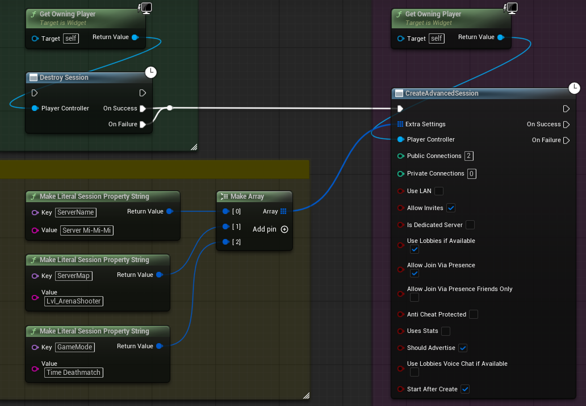
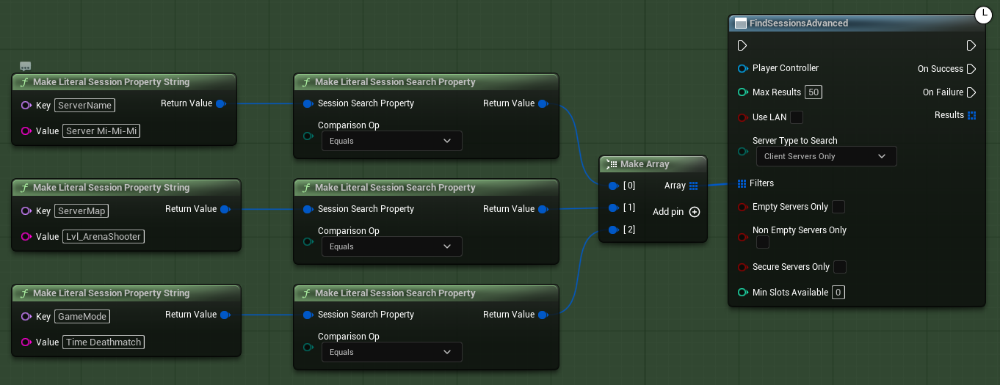
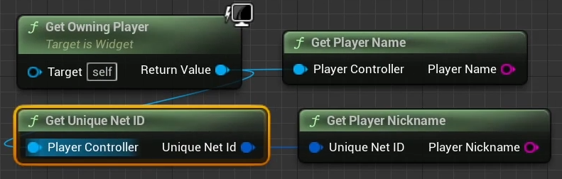
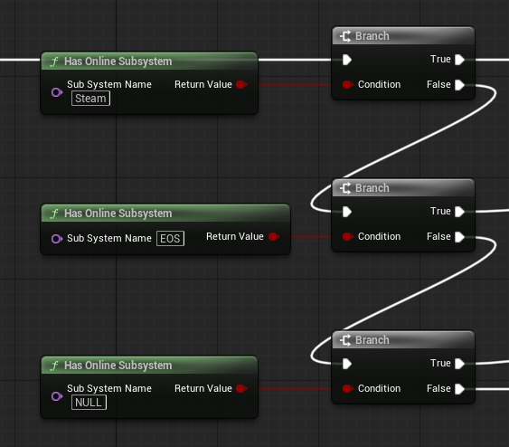
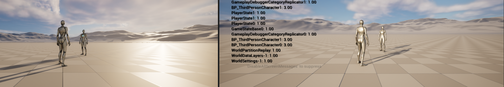

<p align="center">
  <strong>-------></strong>
  <a href="/README.md">Русский</a> |
  <a href="/docs/README.en.md">English</a> |
  <a href="/docs/README.es.md">Spanish</a> |
  <a href="/docs/README.zh.md">Chinese</a> |
  <strong><-------</strong>
</p>


<p align="center">
  <picture>
    <source media="(prefers-color-scheme: dark)" srcset="./media/logo-dark.png">
    
  </picture>
</p>

---

<div align="center">

[](https://github.com/AnikBeris)
[](/LICENSE.md)
[](https://github.com/AnikBeris)

</div>

<div align="center">
  
</div>


<h1 align="center"> 
Полезная информация о разработке проекта на Unreal Engine 5 при использование плагина AdvancedSessions-Steam
</h1>

<h2 align="center">
> 💡 Материал ориентирован для подготовленых пользователей.
</h2>


* * * * * * * * * * * * * * * * * * 
* * * * * * * * * * * * * * * * * * 


<h2 align="center">
⚠️ Отказ от ответственности ⚠️
</h2>

<p align="center">
  Автор не несёт ответственности за любые возможные последствия использования данного проекта.<br>
  Используйте на свой страх и риск.
</p>

<details align="center"> 
    <summary>⚠️полный текст⚠️</summary>
    
Используйте материалы этого репозитория на свой страх и риск.

1. Используя материалы этого репозитория, вы автоматически соглашаетесь с условиями лицензионного соглашения, связанными с ним.

2. Автор не предоставляет никаких гарантий, явных или подразумеваемых, относительно точности, полноты или пригодности этих материалов для каких-либо конкретных целей. 
   
3. Автор не несёт ответственности за любые убытки, включая, помимо прочего, прямые, косвенные, сопутствующие, косвенные или специальные убытки, возникшие из-за использования или невозможности использования материалов из этого репозитория или сопровождающей его документации, даже если о возможности таких убытков было заранее сообщено.

4. Используя эти материалы этого репозитория, вы подтверждаете и принимаете на себя все риски, связанные с его применением. Кроме того, вы соглашаетесь, что автор не может быть привлечён к ответственности за какие-либо проблемы или последствия, возникшие в результате его использования.

</details> 

---

<h3 align="center"> 
💖 Поддержите проект 
</h3>

<p align="center"> 
Если этот проект оказался полезным для Вас, вы можете оценить его, поставив звёздочку.:star2: 
</p>

<p align="center">
  <a href="https://pay.cloudtips.ru/p/7249ba98" target="_blank">
    
  </a>
  <a href="https://pay.cloudtips.ru/p/7249ba98" target="_blank">
    
  </a>
</p>


<h4 align="center"> 
Пожертвования горячо приветствуются, какими бы маленькими они ни были, и большое спасибо. 😌 
</h1>

<div align="center">

|  |  |
|-------------:|:-------------|
| **Tether USDT (BEP20)** |`0x22258ea591966e830199d27dea7c542f31ed5dc5`|
| **Bitcoin (BTC)** |`1Dbwq9EP8YpF3SrLgag2EQwGASMSGLADbh`|
| **Ethereum (ERC20)** | `0x22258ea591966e830199d27dea7c542f31ed5dc5`|
| **Binance Smart Chain (BEP20)** | `0x22258ea591966e830199d27dea7c542f31ed5dc5`|
| **Solana (SOL)** | `yYYXsiVTzsvfvsMnBxfxSZEWTGytjAViE2ojf3hbLeF`|

</div>

---

<p align="center">
  <sub> Спасибо за Ваше внимание к проекту и за поддержку 💙 </sub>
</p>

---

* * * * * * * * * * * * * * * * * * 
* * * * * * * * * * * * * * * * * * 


## 📚 Содержание

- [Введение](#-введение)


## 🔗 Полезные ссылки

  

* * * * * * * * * * * * * * * * * * 
* * * * * * * * * * * * * * * * * * 


<h2 align="center">
  <a href="#-содержание"> ⬆️ Наверх </a> 
</h2>

<h1 align="center"> 
Технические требования
</h1>


## 📊 Установленый плаген

<details> 
    <summary>⚙️ Развернуть описание</summary>

- **Advanced Sessions Plugin:** 
- **Steam:** 

</details> 


## 📊 Отключение плагинов

<details> 
    <summary>⚙️ Развернуть описание</summary>

- **SteamSockets:** Драйвер плагина SteamSockets нужен для работы Steam но в рамках Advanced Sessions Plugin нужно отключить.

</details> 


## 📊 Функции || Особенности

<details> 
    <summary>⚙️ Развернуть описание</summary>


</details>


<h2 align="center">
  <a href="#-содержание">⬆️ Наверх</a> 
</h2>

###### # Project - Maps & Modes

<h1 align="center"> 
Project - Maps & Modes
</h1>

<div align="center">
  
</div>

## Назначение раздела

Раздел **Project - Maps & Modes** определяет ключевые точки входа в игровой флоу и архитектуру проекта. В нем настраивается:

---

- какой `GameMode` используется по умолчанию;
- какие карты (maps) загружаются при старте редактора, игры и сервера;
- какие базовые классы применяются (`Pawn`, `Controller`, `HUD` и т.д.);
- как автоматически подменять `GameMode` в зависимости от карты или ее префикса.

Фактически это **точка входа в архитектуру игрового флоу**.

* * * * * * * * * * * * * * * * * * 
* * * * * * * * * * * * * * * * * * 


<h2 align="center">
  <a href="#-содержание">⬆️ Наверх</a> 
</h2>

###### # Default Modes

<h1 align="center"> 
Default Modes
</h1>

<div align="center">
  
</div>

## Default GameMode

<details>
    <summary align="center"> ⚙️ Развернуть описание </summary>

**Default GameMode** - это `GameMode`, который будет использоваться:

- если кауровень не переопределяет `GameMode`;
- если `GameMode` не указан через URL-параметры;
- если не сработали префиксы или алиасы.

#### Типичное применение

- `GM_Menu` - главное меню
- `GM_Gameplay` - основная игра
- `GM_Lobby` - мультиплеерное лобби

#### Важно

- `GameMode` существует **только на сервере** ( или в singleplayer, как server-authority ).
- Клиенты получают данные через `GameState`.

</details> 

* * * * * * * * * * * * * * * * * * 
* * * * * * * * * * * * * * * * * * 


<h2 align="center">
  <a href="#-содержание">⬆️ Наверх</a> 
</h2>

###### # Selected GameMode

<h1 align="center"> 
Selected GameMode
</h1>

<div align="center">
  
</div>

**Selected GameMode** - Это блок определяет набор классов для выбранного `GameMode` (в данном случае `GM_Menu`).

<details> 
    <summary  align="center"> ⚙️ Развернуть описание </summary>
---

### Default Pawn Class

Определяет, какой `Pawn` будет автоматически заспавнен для игрока.

Примеры:

- `Pawn` - пустышка для меню
- `Character` - если нужен полноценный персонаж
- `SpectatorPawn` - если игрок не должен управлять телом

Для меню:

- часто используется пустой `Pawn` или минимальная логика без управления.

---

### HUD Class

Класс `HUD` (устаревший, но все еще поддерживаемый).

Используется, если:

- UI рисуется через `DrawHUD`;
- применяется старая HUD-логика.

Современная практика:

- `HUD` пустой;
- UI создается через **UMG** в `PlayerController`.

Для меню использование `HUD_Menu` допустимо.

---

### Player Controller Class

Один из ключевых классов архитектуры.

Отвечает за:

- ввод (`Input`);
- создание UI;
- управление камерой;
- переключение режимов ввода (UI / Game).

Примеры:

**В меню**
- `PC_Menu`
- включен `Show Mouse Cursor`
- `Set Input Mode UI Only`

**В игре**
- `PC_Gameplay`
- `Game Only` или `Game and UI`

---

### Game State Class

`GameState` существует **на сервере и клиентах**.

Используется для:

- таймеров;
- текущей фазы матча;
- глобального состояния игры.

Пример:

- `Server_GameState`

Даже в singleplayer рекомендуется хранить данные в `GameState`, а не в `GameMode`.

---

### Player State Class

`PlayerState` существует для каждого игрока.

Хранит:

- очки;
- имя;
- команду;
- перки;
- статистику.

Применение:

- в мультиплеере - обязательно;
- в singleplayer - рекомендуется.

---

### Spectator Class

`Pawn`, который используется:

- при смерти;
- при наблюдении;
- при отсутствии активного `Pawn`.

По умолчанию `SpectatorPawn` - корректный выбор.

</details> 

* * * * * * * * * * * * * * * * * * 
* * * * * * * * * * * * * * * * * * 


<h2 align="center">
  <a href="#-содержание">⬆️ Наверх</a> 
</h2>

###### # Advanced (GameMode)

<h1 align="center"> 
Advanced (GameMode)
</h1>

<div align="center">
  
</div>

<details> 
    <summary  align="center"> ⚙️ Развернуть описание </summary>

### Global Default Server Game Mode

- Используется **только для dedicated server**.

Если задан:

- сервер всегда будет использовать этот `GameMode`;
- независимо от карты.

Обычно:

- `None` - стандартный вариант;
- применяется в серверных сборках.

---

### Game Mode Map Prefixes

<div align="center">
  
</div>

<div align="center">
  
</div>


Позволяет автоматически назначить `GameMode` по префиксу карты.

Пример:

- `MP_` -> `GM_Multiplayer`
- `SP_` -> `GM_Singleplayer`
- `MENU_` -> `GM_Menu`

#### Практическое применение

- одна сборка;
- разные режимы без ручной настройки карт.

Крайне полезно в средних и крупных проектах.

### Настройка в DefaultEngine.ini

```ini
[/Script/EngineSettings.GameMapsSettings]
+GameModeMapPrefixes=(Prefix="MENU_",GameMode="/Game/GameModes/GM_Menu.GM_Menu_C")
+GameModeMapPrefixes=(Prefix="SP_",GameMode="/Game/GameModes/GM_Single.GM_Single_C")
+GameModeMapPrefixes=(Prefix="MP_",GameMode="/Game/GameModes/GM_Multiplayer.GM_Multiplayer_C")
+GameModeMapPrefixes=(Prefix="COOP_",GameMode="/Game/GameModes/GM_Coop.GM_Coop_C")

```

---

### Game Mode Class Aliases

<div align="center">
  
</div>

Позволяет использовать короткие алиасы для `GameMode`. Когда карты тажа, а правила игры специфичны.

Пример классический PvP:

- `"DM"`   -> `GM_Deathmatch`
- `"TDM"`  -> `GM_TeamDeathmatch`
- `"CTF"`  -> `GM_CaptureTheFlag`
- `"FFA"`  -> `GM_FreeForAll`
- `"KOTH"` -> `GM_KingOfTheHill`
- `"SD"`   -> `GM_SearchAndDestroy`

Пример классический PvE:

- `"COOP"`  -> `GM_Coop`
- `"PVE"`   -> `GM_PvE`
- `"SURV"`  -> `GM_Survival`
- `"HORDE"` -> `GM_Horde`
- `"WAVES"` -> `GM_Waves`

Лобби и сервисные режимы:

- `"MENU"`  -> `GM_Menu`
- `"LOBBY"` -> `GM_Lobby`
- `"ENTRY"` -> `GM_Entry`

Одиночный режим:

- `"SP"`       -> `GM_Singleplayer`
- `"STORY"`    -> `GM_Story`
- `"CAMPAIGN"` -> `GM_Campaign`


### Настройка в DefaultEngine.ini

```ini
[/Script/EngineSettings.GameMapsSettings]
+GameModeClassAliases=(ShortName="DM",GameMode="/Game/GameModes/GM_Deathmatch.GM_Deathmatch_C")
+GameModeClassAliases=(ShortName="TDM",GameMode="/Game/GameModes/GM_TeamDeathmatch.GM_TeamDeathmatch_C")
+GameModeClassAliases=(ShortName="COOP",GameMode="/Game/GameModes/GM_Coop.GM_Coop_C")
+GameModeClassAliases=(ShortName="MENU",GameMode="/Game/GameModes/GM_Menu.GM_Menu_C")
```


## Применение на практике
### Через консоль или командную строку

```ini
open Lvl_Arena?game=DM
```

Unreal Engine ищет `DM` в `Game Mode Class Aliases`, игнорирует назначеный `Default GameMode` и заменяет его на `GM_Deathmatch`,


### Через Server Startup

```ini
UEGameServer.exe Lvl_Map?game=TDM?listen
```

### Очень удобно для:

- dedicated servers,
- CI/CD,
- автоматических тестов.

---

### Когда алиасы НЕ нужны

Алиасы не обязательны, если ты используешь:

- `Map Override` в World Settings,
- `Game Mode Map Prefixes`,
- жестко зафиксированый `Default GameMode`.

> В небольших singleplayer проектах алиасы часто вообще не используют.


### Рекомендованная схема для реального проекта

Использовать все три механизма, но по назначению:
|Механизм|Для чего|
|:---------:|:---------|
| Default GameMode | Безопасный fallback |
| Map Override | Явное поведение карты |
| Prefixes | Массовые карты |
| Aliases | CLI, сервер, автоматизация |

</details>

* * * * * * * * * * * * * * * * * * 
* * * * * * * * * * * * * * * * * * 


<h2 align="center">
  <a href="#-содержание">⬆️ Наверх</a> 
</h2>

###### # Default Maps

<h1 align="center"> 
Default Maps
</h1>

<div align="center">
  
</div>


<details> 
    <summary  align="center"> ⚙️ Развернуть описание </summary>


### Editor Startup Map

Карта, которая:

- автоматически открывается при запуске редактора.

Рекомендация:

- легкая карта;
- не основная игровая сцена;
- часто тестовая или меню.

---

### Editor Template Map Overrides

Используется редко.

Назначение:

- переопределение шаблонных карт (template maps);
- актуально для кастомных шаблонов.

В большинстве проектов не используется.

---

### Game Default Map

Карта, которая:

- загружается при запуске игры;
- используется в packaged build.

Обычно:

- главное меню;
- либо стартовый уровень.


</details> 

* * * * * * * * * * * * * * * * * * 
* * * * * * * * * * * * * * * * * * 


<h2 align="center">
  <a href="#-содержание">⬆️ Наверх</a> 
</h2>

###### # Advanced (Maps)

<h1 align="center"> 
Advanced (Maps)
</h1>

<div align="center">
  
</div>

<details> 
    <summary align="center"> ⚙️ Развернуть описание </summary>

### Local Map Options

Позволяет задать URL-параметры по умолчанию.

Пример:

```ini
?listen?game=GM_Gameplay
```

Используется для:

- тестирования;
- локальных серверов;
- автоматических параметров запуска.

---

### Transition Map

Карта, которая:

- загружается временно при смене уровней (Seamless Travel).

Используется в мультиплеере:

- для избежания фризов;
- для плавного перехода между уровнями.

В singleplayer обычно не требуется.

---

### Server Default Map

Карта, которая:

- загружается при старте dedicated server.

Обычно:

- `Entry`;
- или `Lvl_Lobby`.

Важно:

- не влияет на клиента;
- применяется только в серверной сборке.

---

### Настройка в DefaultEngine.ini

```ini
[/Script/EngineSettings.GameMapsSettings]
GameDefaultMap=/Game/Maps/MENU_Main
EditorStartupMap=/Game/Maps/Test_Map
GlobalDefaultGameMode=/Game/GameModes/GM_Menu.GM_Menu_C

```
## Практическая рекомендация для текущей структуры

Типовая схема конфигурации:

- **Editor Startup Map** -> `TestMap`
- **Game Default Map**   -> `Lvl_Menu`
- **Default GameMode**   -> `GM_Menu`
- **Menu Map Override**  -> `GM_Menu`
- **Gameplay Maps**      -> `GM_Gameplay` (через Override или Prefix)

Данная схема обеспечивает чистое разделение меню, геймплея и серверной логики, а также упрощает масштабирование проекта.

</details> 


* * * * * * * * * * * * * * * * * * 
* * * * * * * * * * * * * * * * * * 


<h2 align="center">
  <a href="#-содержание">⬆️ Наверх</a> 
</h2>

###### # Create Session 

<h1 align="center"> 
Create Session с предварительной настройкой
</h1>

<div align="center">
  
</div>

<details> 
    <summary align="center"> ⚙️ Развернуть описание </summary>

```ini
ServerName
```

```ini
ServerMap
```

```ini
GameMode
```

</details> 

* * * * * * * * * * * * * * * * * * 
* * * * * * * * * * * * * * * * * * 

###### # Find Session

<h1 align="center"> 
Find Session с предварительной настройкой
</h1>

<div align="center">
  
</div>

<details> 
    <summary align="center"> ⚙️ Развернуть описание </summary>

```ini
ServerName
```

```ini
ServerMap
```

```ini
GameMode
```

</details> 

* * * * * * * * * * * * * * * * * * 
* * * * * * * * * * * * * * * * * * 

###### # PlayerName PlayerNickname

<h1 align="center"> 
PlayerName | PlayerNickname
</h1>

<div align="center">
  
</div>

<details> 
    <summary align="center"> ⚙️ Развернуть описание </summary>

```sh
HOSTING MATCH
```

```sh
CLIENT
```

```sh
SOLO PLAY
```

</details>


* * * * * * * * * * * * * * * * * * 
* * * * * * * * * * * * * * * * * * 

###### # Проверки


###### # Is Server -> Is Standalone -> Set Text

<h1 align="center"> 
Is Server -> Is Standalone -> Set Text
</h1>

<div align="center">
  
</div>

<details> 
    <summary align="center"> ⚙️ Развернуть описание </summary>

```sh
HOSTING MATCH
```

```sh
CLIENT
```

```sh
SOLO PLAY
```

</details>

---

###### # Has Online Subsystem

<h1 align="center"> 
Has Online Subsystem какая сабсистема активна
</h1>

<div align="center">
  
</div>

<details> 
    <summary align="center"> ⚙️ Развернуть описание </summary>

```sh
Steam
```

```sh
EOS
```

```sh
NULL
```

</details> 


* * * * * * * * * * * * * * * * * * 
* * * * * * * * * * * * * * * * * * 


# Расчет для настройки cетевой пропускной способности `listen server` и `dedicated server` в файле `DefaultEngine.ini` 

## Параметры `GameNetworkManager` и `MaxClientRate`

постараюсь объяснять **как инженерно рассчитываются** параметры сетевой пропускной способности в Unreal Engine особенно, как эта вся чехорда связана между собой.

---

## 1. Описание параметров
## [/Script/OnlineSubsystemUtils.IpNetDriver]
### MaxClientRate
<details> 
    <summary align="center"> ⚙️ Развернуть описание </summary>

```ini
[/Script/OnlineSubsystemUtils.IpNetDriver]
MaxClientRate=500000
```

   Максимальная пропускная способность **на одного клиента**, байты в секунду.

   1. Жесткий верхний лимит, выше этих байтов не прыгнет, это аварийный стоп-кран для сервера.
   2. Сервер никогда не отправит клиенту больше этого значения.
   3. Применяется до `GameNetworkManager` тоесть пишем выше!
      - Пример:
         ```ini
         [/Script/OnlineSubsystemUtils.IpNetDriver]
         MaxClientRate=500000
         [/Script/Engine.GameNetworkManager]
         TotalNetBandwidth=2000000
         ```

### почему не нада выставлять онинаковые значения!!!
> - `MaxClientRate` — аварийный стоп-кран
> - `MaxDynamicBandwidth` — плановый, нежный, средний, как хатите называйте но это лимит

</details> 

---


## [/Script/Engine.GameNetworkManager]
### MaxDynamicBandwidth

<details> 
    <summary align="center"> ⚙️ Развернуть описание </summary>

```ini
MaxDynamicBandwidth=300000
```

- `MaxDynamicBandwidth` - это максимальный лимит пропускной способности, который сервер может **динамически** выделить одному клиенту. Даже если [`MaxClientRate`](#maxclientrate) большой, то сервер никогда не даст клиенту больше указаного значения в `MaxDynamicBandwidth`

Как определить, а сколько нада? В начале Вы должны ответить на другой вопрос `сколько байт в секунду реально нужно одному активному игроку в пике?`

Типовые значения тут берём `пиковые значения`, а не среднее. Чтобы потом не удивлятся.

| Жанр         | Средний      | Впике        |
| ------------ | ------------ | ------------ |
| Кооп / экшен | 80–150 kB/s  | 180–220 kB/s |
| Шутер        | 100–180 kB/s | 250–300 kB/s |
| RPG          | 40–80 kB/s   | 100–120 kB/s |
| Стратегия    | 20–50 kB/s   | 60–80 kB/s   |

но это ещё не всё. Дальше берём наше значение к примеру `Шутер` где `PeakClient=300000 B/s` и к нему домножаем запас `от 20% до 30%` или тоже самое но в числах `от 1.2 до 2.0`

```ini
MaxDynamicBandwidth = PeakClientUsage * (1 + запас)
Где запас = 0.25 это (25 %)
```
теперь то, что получилось подставляем в формулу
```ini
MaxDynamicBandwidth = 300000 * 1.25
```
получаем `MaxDynamicBandwidth = 375000 B/s`

Очень хорошо!
Но и это ещё не всё! Нам нужно проверить согласовоность с [`MaxClientRate`](#maxclientrate) где [`MaxClientRate`](#maxclientrate) должен быть на `20 – 100%` больше `MaxDynamicBandwidth` 

> ( Это даёт запас для packet bursts - это когда происходит резкое увеличение количества передаваемых данных за короткий промежуток времени и пиковых RPC а это относится к моменту максимальной нагрузки на систему удалённых вызовов процедур (Remote Procedure Call), когда количество запросов от клиентов к удалённым функциям достигает максимума)

| MaxClientRate | Поведение            |
| ------------- | -------------------- |
| 0%   это ×1   | риск дропа пакетов   |
| 20%  это ×1.2 | минимально безопасно |
| 50%  это ×1.5 | стабильно            |
| 100% это ×2.0 | с запасом            |

```ini
MaxClientRate = 375000 * 1.5
MaxClientRate = 562500 B/s
```

вот, что можем получить на выходе

| Параметр            | Значение      | Примечание                                  |
| ------------------- | ------------- | ------------------------------------------- |
| MaxDynamicBandwidth | 375000        | Рабочий потолок на клиента                  |
| MaxClientRate       | 450000–750000 | В зависимости от желаемого запаса, 1.2–2.0× |


и теперь остался последни рывок. Расчитать `TotalNetBandwidth`

   - Тут всё просто нам известно сколько играков играет на карте. К примеру `играет 8 чиловек`, также мы просчитали, что `MaxDynamicBandwidth = 375000` + нам нужен ещё один небольшой запас в виде `от 10% до 20%` или тоже самое но в числах `от 1.1 до 1.2` тогда:
   
   ```ini
   TotalNetBandwidth >= MaxDynamicBandwidth=375000 * 8 * 1.2 = 3600000 B/s
   ```

</details> 

---

### MinDynamicBandwidth

<details> 
    <summary align="center"> ⚙️ Развернуть описание </summary>


```ini
MinDynamicBandwidth=50000
```

Это гарантированный минимум трафика на клиента в байтах/сек. Даже если пул `TotalNetBandwidth` перегружен, сервер не отдаст клиенту меньше значения указаного в `MinDynamicBandwidth`. Если клиентов слишком много и пул `TotalNetBandwidth` не покрывает всех — UE начинает дропать лишние данные у низкоприоритетных акторов, но каждому клиенту будет хотя бы по `MinDynamicBandwidth`.

И зачем нам это нужен:
   - Предотвращает полное зависание клиента, когда высокоприоритетные игроки или события вытягивают весь пул `TotalNetBandwidth` насебя.
   - Обеспечивает минимальную стабильность соединения, даже при перегрузке.
   - Работает вместе с `MaxDynamicBandwidth` 


пример конфига для наглядности:

| Параметр            | Значение  |
| ------------------- | ----------|
| TotalNetBandwidth   | 3 600 000 |
| клиентов            | 8         |
| MaxDynamicBandwidth | 375 000   |
| MinDynamicBandwidth | 50 000    |

В этом случае если нагрузка привысит `MaxDynamicBandwidth=375 000` то каждый клиент получит хотя бы 50kB/s, а остальное распределится по [приоритету](#приоритеты) акторов.


</details>

---
---
---

### TotalNetBandwidth

<details> 
    <summary align="center"> ⚙️ Развернуть описание </summary>

```ini
TotalNetBandwidth=3600000
```

Общий бюджет пропускной способности сервера `на всех клиентов`. Тоесть взяли значение из `MaxClientRate`, `умножили` на `количество игроков` и потом умножили на запас `от 1.1 до 1.2` на выходе получили значение для `TotalNetBandwidth`. 

> Если суммарные потребности всех клиентов превышают это значение, сервер начинает урезать трафик.

Ещё раз для понимания `TotalNetBandwidth` — это общий пул. Когда суммарный исходящий трафик на всех (клиентов * `MaxDynamicBandwidth`) превышает пул (`TotalNetBandwidth`) то сервер начинает чикать ненужное. Как делает сервер а именно `GameNetworkManager`:

   1. Сначала распределяет пул (`TotalNetBandwidth`) среди клиентов по [приоритету](#приоритеты) акторов.
   2. Когда клиент получает свою долю по приоритету.
      - Сервер проверяет: не превышает ли ваше потребление число написанное в `MaxClientRate` и если оно всётаки превышает, то режет трафик до выставленых значений в `MaxClientRate`


---

### MinDynamicBandwidth

```ini
MinDynamicBandwidth=50000
```

Гарантированный минимум на клиента даже при перегрузке. [#когда-реально-вступает-mindynamicbandwidth](#когда-реально-вступает-mindynamicbandwidth) 


---

## 2. Порядок расчета пропускной способности в Unreal Engine

Сервер, а именно `GameNetworkManager` при создание сессии берет общий пул `TotalNetBandwidth` и делит его между всеми клиентами по принципу
1. Для каждого клиента гарантировано выделяет `MinDynamicBandwidth`, а потом, что осталось в пуле пытается разделить месжу всеми до максимального значения `MaxDynamicBandwidth`.

Потом в игру вступает драйвер `IpNetDriver` c его значениями `MaxClientRate`. 
1. Если потребление привышает значение `MaxDynamicBandwidth` даже при условие свободного пула `TotalNetBandwidth` но мы ещё не достигли потолка в виде `MaxClientRate` управление остаётся у `GameNetworkManager` и драйвер соединения `IpNetDriver` не вмешивается. Сервер начинает сортировать репликацию по [приоритету](#приоритеты) и отправляет только то, что влезло в `MaxDynamicBandwidth`. Лишнее что не влезло в зависимости от данных будут отправлено в следующих тиках.

## Репликация акторов
- низкоприоритетные обновления пропускаются
- они будут отправлены в следующих тиках

## Unreliable RPC
- дропаются
- не повторяются

## Reliable RPC
- остаются в очереди
- если их слишком много, могут заблокировать канал.


> Важно понимать, что это не потеря! Состояние мира не ломается, сервер продалжает слать последнии актуальные состояния. Промежуточные апдейты могут быть и скорей всего будут пропущены. Это нормальное сетевое сглаживание, а не ошибка.

---

## Сценарий 1

`Потребление > MaxDynamicBandwidth, но <= MaxClientRate`

```ini
RequiredBandwidth = 350 kB/s
MaxDynamicBandwidth = 250 kB/s
MaxClientRate = 500 kB/s
```

Что делает сервер

1. GameNetworkManager
   - видит, что клиент хочет 350 kB/s
   - но потолок = MaxDynamicBandwidth = 250 kB/s

выделяет ровно 250 kB/s

2. MinDynamicBandwidth
   - НЕ вступает
   - он нужен только если выделение падает ниже минимума

3. IpNetDriver
   - проверяет MaxClientRate
   - 250 kB/s < 500 kB/s = всё хорошо и драйвер не вмешивается

4. Итог
   - клиент получает 250 kB/s
   - лишние данные:
   - откладываются
      - понижаются в приоритете
      - могут быть пропущены (низкий NetPriority)


## Сценарий 2

`Потребление > MaxDynamicBandwidth и > MaxClientRate`

```ini
RequiredBandwidth = 600 kB/s
MaxDynamicBandwidth = 250 kB/s
MaxClientRate = 300 kB/s
```

Что делает сервер

1. GameNetworkManager
   - видит потребность в 600 kB/s
   - ограничивает до MaxDynamicBandwidth = 250 kB/s
   - MinDynamicBandwidth не нужен (250 kB/s > min)

2. IpNetDriver
   - получает 250 kB/s
   - проверяет MaxClientRate = 300 kB/s
   - 250 kB/s <= 300 kB/s = всё хорошо и драйвер не вмешивается

4. Итог
   - клиент всё равно получает 250 kB/s
   - превышение MaxClientRate не имеет значения, т.к. до него не дошли


## Сценарий 3 важный граничный случай
`MaxDynamicBandwidth > MaxClientRate`

```ini
RequiredBandwidth = 600 kB/s
MaxDynamicBandwidth = 400 kB/s
MaxClientRate = 300 kB/s
```

Что делает сервер

1. GameNetworkManager
   - видит потребность в 600 kB/s
   - ограничивает до MaxDynamicBandwidth = 400 kB/s
2. IpNetDriver 
   - режет до 300 kB/s
3. Вот здесь начинаются проблемы:
   - [дроп пакетов](#dropped-data-отброшенные-данные)
   - [Dropped Bunches](#dropped-bunches-сброшенные-сетевые-блоки-ue)
   - [рост latency](#рост-latency-рост-сетевой-задержки)


## Когда реально вступает `MinDynamicBandwidth`

`MinDynamicBandwidth` вступает ТОЛЬКО если:

```cs
(при распределение TotalNetBandwidth доля клиента) < MinDynamicBandwidth
```

Пример:

```ini
TotalNetBandwidth = 500 kB/s
MinDynamicBandwidth = 80 kB/s
Clients = 10 
```

Подсичтаем сколько приходится на клиента TotalNetBandwidth / Clients

```
500 / 10 = 50
Доля = 50 kB/s
```

доля кна клиента приходится 50 kB/s но MinDynamicBandwidth = 80 kB/s
   - сервер не может выполнить контракт
   - [saturation](#saturation-перегрузка-сетевого-канала), [dropped data](#dropped-data-отброшенные-данные)

Если:

```ini
TotalNetBandwidth = 500 kB/s
MinDynamicBandwidth = 80 kB/s
Clients = 6 
```

то

```
500 / 6 = 83.3
Доля = 83.3 kB/s
```

проверяем

```ini
Доля = 83.3 kB/s
MinDynamicBandwidth = 80 kB/s
```
то игрок получит гарантировано 80 kB/s остаток пула поделется между всеми.


# Итоговые правила

   - `MaxDynamicBandwidth` < `MaxClientRate`
   - `MinDynamicBandwidth` - гарантированое число `kB/s`
   - `MaxClientRate` - аварийный стоп
   - Режет сначала менеджер `GameNetworkManager`, потом драйвер `IpNetDriver`
   - Лучше не доходить до драйвера вообще


</details> 


---
---
---

## Проверка сети `stat net`

<details> 
    <summary align="center"> ⚙️ Развернуть описание </summary>

Команда в консоли:

```text
stat net
```

Следите за:
   - In Rate / Out Rate
   - Saturated Connections
   - Dropped RPC

---

## 8. Итог

- MaxClientRate - теоретический потолок
- MaxDynamicBandwidth - реальный потолок
- TotalNetBandwidth - сумма на всех
- MinDynamicBandwidth - гарантия минимума

</details> 


## Приоритеты обектов `NetPriority` при репликации

<details> 
    <summary align="center"> ⚙️ Развернуть описание </summary>

А теперь немного про приоритеты. У каждого реплицируемого актора есть параметор `NetPriority` по уполчанию `NetPriority = 1.0` 

   - UE использует формулу ( это очень упрощённо):

   ```
   EffectivePriority =
   NetPriority
    * TimeSinceLastUpdate
   / DistanceFactor
   ```

   Усреднёные значения приоритетов с игрулек `Conan Exiles`, `Dune: Awakening` и `Palworld`
      
   |Тип                |NetPriority|
   |------------------ |:----------|
   |PlayerCharacter    |3.0–4.0    |
   |PlayerWeapon       |2.5        |
   |AI боты, враги и.тд|1.5        |
   |Projectiles        |2.0–3.0    |
   |Loot / World props |0.5–1.0    |

   Тут мы понимаем, что низкоприоритетные акторы страдают первыми при отсичении

>     НО есть прикол, что владелец (Owner) имеет скрытый бонус где SetOwner(PlayerController)
>     получают:
>     - более частую репликацию
>     - меньше throttling
>     
>     Используйте для:
>     - оружия
>     - инвентаря
>     - UI-состояний

Если хотите, чтобы клиент `не страдал или страдал последним` то настриваем (буква "f" после значения 3.5f означает что это `float` ):

[NetUpdateFrequency](https://dev.epicgames.com/documentation/en-us/unreal-engine/property-replication-in-unreal-engine?application_version=5.2#data-drivennetworkupdatefrequency) - По умолчанию функция отключена, чтобы включить вписываем в консоль.

```sh
net.UseAdaptiveNetUpdateFrequency 1
```

[NetPriority](https://dev.epicgames.com/documentation/en-us/unreal-engine/actor-priority-in-unreal-engine) - Фактический приоритет рассчитывается с учетом базового `NetPriority`, чтобы дать больше данных тем, кто ближе к игроку ну или важнее для игры.  расстояния до зрителя и времени, прошедшего с момента последней репликации, . 

Пример: `NetPriority 2.0` получит в два раза больше обновлений, чем `NetPriority 1.0`. Тут главное соотношение, чем сами числа.  Нельзя улучшить сеть, просто подняв все приоритеты.


Присеты из разных игр:

1. PlayerCharacter:
   
   ```ini
   NetPriority = 3.5f;
   NetUpdateFrequency = 30.f;
   ```

2. Его оружие:
   
   ```ini
   NetPriority = 2.5f;
   bOnlyRelevantToOwner = true;
   ```

3. Мир:

   ```ini
   NetPriority <= 1.0f;
   NetUpdateFrequency <= 5.f;
   ```


   Что бы увидеть приоритет в действии две команды
      ```ini
      stat net
      ```

      ```ini
      net.DumpRelevantActors
      ```

   Тут нам важно увидеть:
   - кто отправляется первым
   - кто откладывается на потом
   - какие акторы дропаются


<div align="center">
  
</div>

</details> 


* * * * * * * * * * * * * * * * * * 
* * * * * * * * * * * * * * * * * * 


# Терминология

<details> 
    <summary align="center"> ⚙️ Развернуть описание </summary>

Документ описывает ключевые сетевые термины Unreal Engine, которые часто встречаются
при настройке `GameNetworkManager`, `IpNetDriver` и анализе `Stat Net`.

Все термины приведены **с пояснениями в скобках**, чтобы избежать двусмысленности.

---

## Saturation (перегрузка сетевого канала)

**Что это:**  
Состояние, при котором сервер **не может отправить весь запланированный сетевой трафик**
из-за ограничения пропускной способности.

**Основные причины:**
- превышен `TotalNetBandwidth` (общий пул сервера)
- превышены плановые лимиты клиента (`MaxDynamicBandwidth`)
- слишком много реплицируемых акторов

**Что происходит в UE:**
- данные не помещаются в текущий сетевой тик
- часть репликации переносится на следующий тик
- низкоприоритетные акторы обновляются реже

**Визуальные симптомы:**
- рывки
- запаздывающие обновления
- рост задержек

---

## Dropped data (отброшенные данные)

**Что это:**  
Данные, которые **движок Unreal Engine решил не отправлять вовсе**, а не отложить.

**Причины:**
- превышен `MaxClientRate` (жёсткий лимит клиента)
- данные не влезли в сетевой тик
- слишком низкий приоритет актора или RPC

**Последствия:**
- клиент никогда не получит эти данные
- состояние будет догнано следующим обновлением

---

## Рост latency (рост сетевой задержки)

**Latency (задержка)** — это время между отправкой данных сервером и их получением клиентом.

**Рост latency означает:**
- клиент получает устаревшее состояние мира
- увеличивается разница между серверным и клиентским состоянием

**Причины:**
- данные копятся в очереди отправки
- сервер или сеть не успевают передавать трафик

**Проявления в игре:**
- дергание объектов
- резкие коррекции позиций
- визуальные телепорты

---

## Dropped Bunches (сброшенные сетевые блоки UE)

**Bunch (сетевой бандл UE)** — логическая единица данных внутри Unreal Engine:
- репликация свойств акторов
- RPC
- контрольные сообщения

**Dropped Bunches — это:**
- bunch был сформирован движком
- но **не был отправлен**
- и был **осознанно отброшен UE**

**Важно:**
- это НЕ потеря UDP-пакета
- это решение самого движка

**Последствия:**
- RPC может не дойти
- обновление состояния произойдёт позже, другим bunch

---

## Дроп пакетов (packet loss, потеря пакетов)

**Что это:**  
Физическая потеря UDP-пакета в сети, вне контроля Unreal Engine.

**Причины:**
- IP-фрагментация (слишком большой пакет)
- нестабильный интернет
- Wi-Fi, VPN, мобильные сети
- превышение MTU

**Отличие от Dropped Bunches:**

| Тип | Где происходит |
|-----------------|----------------------|
| Dropped Bunches | внутри Unreal Engine |
| Packet loss     | на уровне сети       |

---

## Связь терминов с сетевыми лимитами UE

| Симптом | Типичная причина |
| ------------------------------- | ------------------------------------------- |
| Saturation (перегрузка)         | `TotalNetBandwidth`, `MaxDynamicBandwidth`  |
| Dropped data (данные отброшены) | `MaxClientRate`, низкий приоритет           |
| Рост latency (задержка)         | очередь отправки, нехватка bandwidth        |
| Dropped Bunches                 | жёсткие лимиты отправки                     |
| Packet loss (потеря пакетов)    | `MaxPacket` слишком большой или плохая сеть |

---

## Краткие правила

- Если **UE не успевает отправлять** → saturation (перегрузка)
- Если **UE сам выкидывает данные** → dropped bunches
- Если **сеть теряет пакеты** → packet loss
- Если **данные копятся** → растёт latency

---

Документ предназначен для использования при:
- настройке listen server и dedicated server
- анализе `Stat Net`
- подборе `TotalNetBandwidth`, `MaxDynamicBandwidth`, `MaxClientRate`, `MaxPacket`


</details>


* * * * * * * * * * * * * * * * * * 
* * * * * * * * * * * * * * * * * * 


<h1 align="center"> 📜 Лицензия </h1>
<p align="center">
  <strong> Этот проект распространяется по </strong> 
  <a href="/LICENSE">Apache License</a> 
</p>

---

<h2 align="center"> 
Документация ознакомьтесь с ней 
</h2>


<p align="center">
  <strong>-------></strong>
  <a href="/README.md">Русский</a> |
  <a href="/docs/README.en.md">English</a> |
  <a href="/docs/README.es.md">Spanish</a> |
  <a href="/docs/README.zh.md">Chinese</a> |
  <strong><-------</strong>
</p>


